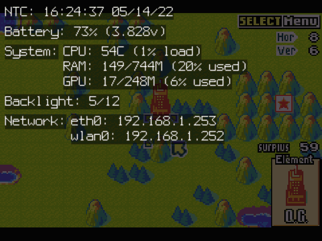
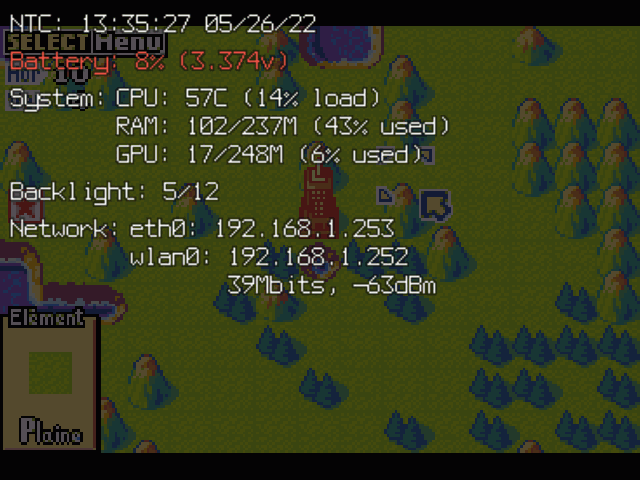

# Freeplay OSD

## Introduction:  
This program allows to display On-screen (heads-up) display overlay.
It happens in two ways (detailed in lower sections):
- Sending SIGUSR1 or SIGUSR2 signal to the program to display useful informations like time, battery, system state and more.
- Display a low battery icon based on a GPIO input or use of a power_supply compatible battery gauge IC.  
  
This program targets Raspberry Pi platforms as it rely on Dispmanx API and is meant to run as a daemon.  
Currently tested on Pi3, Zero 2.  

/!\ Very early version, still under developpement.

Credits goes where its due:
- This project is inspirated by Retropie-open-OSD (https://github.com/vascofazza/Retropie-open-OSD).
- Contain modified and unmodified code from Raspidmx (https://github.com/AndrewFromMelbourne/raspidmx).  
<br>
  
## Preview:
- Full OSD :  
    
  
- Low battery :  
   
<br>
  
## Compilation:
### Required libraries
  - ``libpng-dev``, ``zlib1g-dev``, ``libraspberrypi-dev``.
  - ``wiringpi`` : please refer to ``USE_WIRINGPI``.
  - ``libgpiod-dev`` : please refer to ``USE_GPIOD``.  
<br>

### Preprocessor variables (gcc -D) to enable features:
Note about GPIO related variables : Only one kind will be allowed at once.  

  - ``USE_WIRINGPI``
    * Allow to poll GPIO pin using WiringPi library for low battery detection.  
    * ``-lwiringPi`` needs to be added to compilation command line.  
    * **Note for Pi Zero 2**: You may need to clone and compile for unofficial github repository as official WiringPi ended development, please refer to: https://github.com/PinkFreud/WiringPi  
  <br>

  - ``USE_GPIOD``
    * Allow to poll GPIO pin using libGPIOd library for low battery detection.  
    * ``-lgpiod`` (``-l:libgpiod.a`` for static) needs to be added to compilation command line.  
  <br><br>

### Examples:
Use ``libpng.a``, ``libz.a`` and ``libm.a`` instead of ``-lpng`` for static version of libpng.  

  - WiringPi support  
    ```
    gcc -DUSE_WIRINGPI -o fp_osd fp_osd.c -lpng -lbcm_host -L/opt/vc/lib/ -I/opt/vc/include/ -lwiringPi
    ```

  - libGPIOd support  
    ```
    gcc -DUSE_GPIOD -o fp_osd fp_osd.c -lpng -lbcm_host -L/opt/vc/lib/ -I/opt/vc/include/ -lgpiod
    ```

  - no GPIO support  
    ```
    gcc -o fp_osd fp_osd.c -lpng -lbcm_host -L/opt/vc/lib/ -I/opt/vc/include/
    ```
<br>

## Usage:
### Arguments:
  (\*) : Require program to be compiled with GPIO support (please refer to Preprocessor variables section).  
  (\*\*) : Relative or full path, invalid path to fully disable.  
  (\*\*\*) : file containing only numerical value.  

  - Common :
    * ``-h`` or ``-help`` : Show arguments list.  
    * ``-debug <1-0>`` : Enable/disable stderr debug outputs.  
    <br>

  - Low battery management :  
    * ``-lowbat_gpio <GPIO_PIN>`` (\*) : Low battery GPIO pin (usually triggered by a PMIC or Gauge IC), set to -1 to disable.  
    * ``-lowbat_gpio_reversed <0-1>`` (\*) : 0 for active high, 1 for active low.  
    * ``-battery_rsoc <PATH>`` (\*\*)(\*\*\*) : Path to file containing current remaining percentage of battery.  
    Default: ``/sys/class/power_supply/battery/capacity``  
    * ``-battery_voltage <PATH>`` (\*\*)(\*\*\*) : Path to file containing current battery voltage (program can parse file with float/double format).  
    Default: ``/sys/class/power_supply/battery/voltage_now``  
    * ``-battery_volt_divider <NUM>`` : Divider to get actual voltage (1000 for millivolts as input).  
    * ``-lowbat_pos <tl/tr/bl/br>`` : Low battery icon position : Top Left,Right, Bottom Left,Right.  
    * ``-lowbat_width <1-100>`` : Low battery icon width in percent (relative to screen width).  
    * ``-lowbat_limit <0-90>`` : Threshold to trigger low battery icon in percent (require valid ``-battery_rsoc`` argument path).  
    * ``-lowbat_blink <0.1-10>`` : Low battery icon visible/hide interval in seconds.  
    <br>

  - OSD display :  
    * ``-display`` : Dispmanx display (0 for main screen).  
    * ``-layer`` : Dispmanx layer (10000 by default to ensure it goes over everything else).  
    * ``-timeout <1-20>`` : Hide OSD after given duration.  
    * ``-check <1-120>`` : Signal/GPIO check interval in hz.  
    * ``-signal <SIG>`` : Signal to display OSD (SIGUSR1 or SIGUSR2 depending on configuration).  
    <br>

  - OSD styling :  
    * ``-bg_color <RGB,RGBA>`` : Background color (alpha midpoint to opaque used as background for text).  
    * ``-text_color <RGB,RGBA>`` : Text color.  
    * ``-warn_color <RGB,RGBA>`` : Warning text color.  
    * ``-crit_color <RGB,RGBA>`` : Critical text color.  
    <RGB,RGBA> uses html format (without # character), allow both 1 or 2 hex per color channel (including alpha channel).  
    * ``-max_lines <1-999>`` : Absolute limit lines count on screen (15 by default).  
    * ``-text_padding <0-100>`` : Text distance (px) to screen border in pixels.  
    <br>

  - OSD data :  
    * ``-rtc <PATH>`` (\*\*) : Path used to check if RTC module installed.  
    * ``-cpu_thermal <PATH>`` (\*\*)(\*\*\*) : Path to file containing current CPU temperature.  
    Default: ``/sys/class/thermal/thermal_zone0/temp``  
    * ``-backlight <PATH>`` (\*\*)(\*\*\*) : File containing backlight current value.  
    * ``-backlight_max <PATH>`` (\*\*)(\*\*\*) : File containing backlight maximum value.  
<br>

### Informations displayed on OSD:
Notes: May change without notice, Displayed elements depends on current hardware setup.  

- Time :  
  If RTC module installed (and configured) or system time synchronized with NTC service, full time and date will be displayed.  
  If not, system Uptime will be displayed instead.  
<br>

- Battery :  
  Require a Battery gauge IC to be installed and configured.  
  Please refer to ``-battery_rsoc <PATH>``, ``-battery_voltage <PATH>``, and ``-battery_volt_divider <NUM>`` arguments for custom paths.  
  Displays percentage remaining and voltage depending on path validity.  
<br>

- System (only displays informations successfully recovered) :  
  * CPU temperature and load.  
  * Main memory, Used and Total memory (only displayed if total recovered).  
  * GPU memory, Used and Total memory (only displayed if total recovered).  
<br>

- Backlight status :  
  Please refer to ``-backlight <PATH>`` and ``-backlight_max <PATH>`` arguments for custom paths.  
  Displayed only if valid backlight value recovered.  
<br>

- Network :  
  Interfaces list with assigned IPv4 address.  
  Not yet implemented but could in the future: WiFi signal values.  
<br>

## Repository files
- **res/** : Contain resources linked to the program like icons and other.
- **font.h** : Bitmap font from Raspidmx project.
- **fp_osd.h**/**fp_osd.c** : OSD program.
- **compile.sh** : Sample script to compile program.
- **osd.sh**/**osdbar.sh** : Sample script to send signal to OSD program.
<br><br>
  
## Missing features
Section to be considered as a pseudo todo.  
- Small OSD version to display as header or footer.  
- WiFi informations.
<br><br>

## Known issue(s)
- Program closes if receiving undefined signal (into program code).  
- In very rare instances, when program closes, a float exception can happen.  
<br><br>
