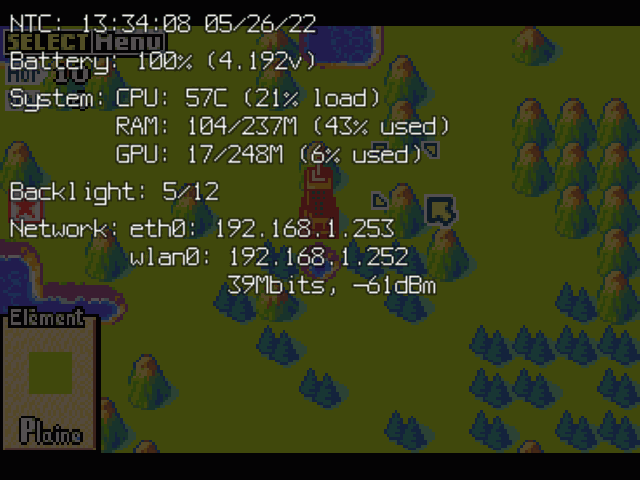

# Freeplay OSD

## Introduction:  
This program allows to display On-screen (heads-up) display overlay.
It happens in two ways (detailed in lower sections):
- Sending SIGUSR1 or SIGUSR2 signal to the program to display useful informations like time, battery, system state and more.
- Display a low battery icon based on a GPIO input or use of a power_supply compatible battery gauge IC.  
  
This program targets Raspberry Pi platforms as it rely on Dispmanx API and is meant to run as a daemon.  
Currently tested on Pi3, Zero 2.  

/!\ Early version, still under developpement.  

Keeping documentation up-to-date during development cycle is pretty difficult, a few things may be outdated or not properly documented (even not)... Sorry about that.  

Credits goes where its due:
- This project is inspirated by [Retropie-open-OSD](https://github.com/vascofazza/Retropie-open-OSD).  
- Contain modified code from [Raspidmx](https://github.com/AndrewFromMelbourne/raspidmx).  
- Event device input code partially based on **evtest** program by Vojtech Pavlik.  
<br>
  
## Preview:
- Full OSD :  
    
  
- Tiny OSD :  
   
  
- Low battery :  
    
<br>
  
## Compilation:
### Required libraries
  - ``libpng-dev``, ``zlib1g-dev``, ``libraspberrypi-dev``.  
  - ``wiringpi`` : please refer to ``USE_WIRINGPI``.  
  - ``libgpiod-dev`` : please refer to ``USE_GPIOD``.  
<br>

### Preprocessor variables (gcc -D) to enable features:
- GPIO library support:
  - Only one kind of library will be allowed at once.
  - You can also disable gpio with program argument ``-lowbat_gpio -1``, ``-osd_gpio -1``, ``-tinyosd_gpio -1`` or set [settings.h](settings.h) 'lowbat_gpio', 'osd_gpio', 'tinyosd_gpio' variables to -1.
  - Program will fall back on ``raspi-gpio`` program if library fails and at least one GPIO pin not disabled (user will have to set pins to input mode on there own in this case).  

  - ``USE_WIRINGPI``
    * Allow to poll GPIO pins using WiringPi library (better choise if supported as it does allow multiple programs to poll the same pin).  
    * ``-lwiringPi`` needs to be added to compilation command line.  
    * **Note for Pi Zero 2 users**: You may need to clone and compile for unofficial github repository as official WiringPi ended development, please refer to https://github.com/PinkFreud/WiringPi if your distribution repository doesn't provide updated binaries. 
  <br>

  - ``USE_GPIOD``
    * Allow to poll GPIO pins using libGPIOd library.  
    * ``-lgpiod`` (``-l:libgpiod.a`` for static) needs to be added to compilation command line.  
    * **Important note**: Will fail if one GPIO pin already used by another program.  
  <br>

- Fully disable specific features:
  - (\*) : will be set by default if ``NO_OSD`` and ``NO_TINYOSD`` both set.
  - ``NO_GPIO`` : Fully disable all GPIO related features.  
  - ``NO_SIGNAL`` (\*) : Ignore ``SIGUSR1`` and ``SIGUSR2`` signal to trigger OSD.  
  - ``NO_SIGNAL_FILE`` (\*) : Disable OSD trigger using file.  
  - ``NO_EVDEV`` (\*) : Disable OSD trigger using input event device.  
  - ``NO_BATTERY_ICON`` : Disable low battery warning icon.  
  - ``NO_CPU_ICON`` : Disable CPU overheat warning icon.  
  - ``NO_OSD`` : Disable full screen OSD.  
  - ``NO_TINYOSD`` : Disable Tiny OSD.  
  <br>

- Debug specific:
  - ``CHARSET_EXPORT`` : Export current characters set defined in [font.h](font.h) to [res/charset_raspidmx.png](res/charset_raspidmx.png) and [res/charset_icons.png](res/charset_icons.png) when program starts, should only be used during development.  
  - ``BUFFER_PNG_EXPORT`` (D1): Allow to export bitmap buffers to PNG files (``-buffer_png_export`` argument).  
  <br>

### Examples:
Use ``libpng.a``, ``libz.a`` and ``libm.a`` instead of ``-lpng`` for static version of libpng.  

  - WiringPi support  
    ```
    gcc -DUSE_WIRINGPI -o fp_osd fp_osd.c -lpng -lbcm_host -L/opt/vc/lib/ -I/opt/vc/include/ -lwiringPi
    ```

  - libGPIOd support  
    ```
    gcc -DUSE_GPIOD -o fp_osd fp_osd.c -lpng -lbcm_host -L/opt/vc/lib/ -I/opt/vc/include/ -lgpiod
    ```

  - No GPIO library support  
    ```
    gcc -o fp_osd fp_osd.c -lpng -lbcm_host -L/opt/vc/lib/ -I/opt/vc/include/
    ```
<br>

## Usage:
### Arguments:
  (\*) : Require program to be compiled with GPIO support (please refer to Preprocessor variables section).  
  (\*\*) : Relative or full path, invalid path to fully disable.  
  (\*\*\*) : File containing only numerical value.  
  (SOMETHING) : Only available if related preprocessor variable set.  
  (!SOMETHING) : Only available if related preprocessor NOT variable set.  

  - Common :
    * ``-h`` or ``-help`` : Show arguments list.  
    * ``-display`` : Dispmanx display (0 for main screen).  
    * ``-layer`` : Dispmanx layer (10000 by default to ensure it goes over everything else).  
    * ``-check <1-120>`` : Main loop limits in hz, limited impact on performance.  
    * ``-debug <1-0>`` : Enable/disable stderr debug outputs.  
    * ``-buffer_png_export`` (D1) : Export all drawn buffers to PNG files into **debug_export** folder.  
    <br>
  
  - Warning icons (!NO_BATTERY_ICON)(!NO_CPU_ICON) :  
    * ``-icons_pos <tl/tr/bl/br>`` : icons position on screen : Top Left,Right, Bottom Left,Right.  
    * ``-icons_height <1-100>`` : icons height in percent (relative to screen height).  
    * ``-lowbat_test`` (!NO_BATTERY_ICON) : Low battery icon will be displayed until program closes (for test purpose).  
    * ``-cputemp_test`` (!NO_CPU_ICON) : CPU temperature warning icon will be displayed until program closes (for test purpose).  
    <br>
  
  - Low battery management :  
    * ``-battery_rsoc <PATH>`` (\*\*)(\*\*\*) : Path to file containing current remaining percentage of battery.  
      Default: ``/sys/class/power_supply/battery/capacity``  
    * ``-battery_voltage <PATH>`` (\*\*)(\*\*\*) : Path to file containing current battery voltage (program can parse file with float/double format).  
      Default: ``/sys/class/power_supply/battery/voltage_now``  
    * ``-battery_volt_divider <NUM>`` : Divider to get actual voltage (1000 for millivolts as input).  
    * ``-lowbat_limit <0-90>`` : Threshold to trigger low battery icon in percent (require valid ``-battery_rsoc`` argument path).  
    * ``-lowbat_gpio <GPIO_PIN>`` (\*)(!NO_GPIO) : Low battery GPIO pin (usually triggered by a PMIC or Gauge IC), set to -1 to disable.  
    * ``-lowbat_gpio_reversed <0-1>`` (\*)(!NO_GPIO) : 0 for active high, 1 for active low.  
    <br>

  - EVDEV input (!NO_EVDEV), please refer to ``Event device input`` section for more informations :
    * ``-evdev_path <PATH>`` (\*\*) : Folder or file to use as input device (``/dev/input/`` by default).  
    * ``-evdev_device <NAME>`` : Device to search if ``-evdev_path`` argument is a folder.  
    * ``-evdev_failure_interval <NUM>`` : Retry interval if input device failed (10 by default).  
    * ``-evdev_detect_interval <NUM>`` : Input sequence detection timeout in millisec (200 by default).  
    * ``-evdev_osd_sequence <KEYCODE,KEYCODE,...>`` (!NO_OSD) : OSD trigger sequence (``0x13c,0x136,0x137`` by default).  
    * ``-evdev_tinyosd_sequence <KEYCODE,KEYCODE,...>`` (!NO_TINYOSD) : Tiny OSD trigger sequence (``0x13c,0x138,0x139`` by default).  
    <br>

  - OSD display (!NO_OSD) :  
    * ``-osd_max_lines <1-999>`` : Absolute limit lines count on screen (15 by default).  
    * ``-osd_text_padding <0-100>`` : Text distance (px) to screen border in pixels.  
    * ``-signal_file <PATH>`` (\*\*)(\*\*\*)(!NO_SIGNAL_FILE) : Path to signal file, useful if you can't send signal to program.  
      Should only contain '0', SIGUSR1 or SIGUSR2 value.  
    * ``-osd_gpio <GPIO_PIN>`` (\*)(!NO_GPIO) : OSD display trigger GPIO pin, set to -1 to disable.  
    * ``-osd_gpio_reversed <0-1>`` (\*)(!NO_GPIO) : 0 for active high, 1 for active low.  
    * ``-osd_test`` : full OSD will be displayed until program closes (for test purpose).  
    <br>

  - OSD styling (!NO_OSD)(!NO_TINYOSD) :  
    * ``-timeout <1-20>`` : Hide OSD after given duration.  
    * ``-bg_color <RGB,RGBA>`` : Background color (alpha midpoint to opaque used as background for text).  
    * ``-text_color <RGB,RGBA>`` : Text color.  
    * ``-warn_color <RGB,RGBA>`` : Warning text color.  
    * ``-crit_color <RGB,RGBA>`` : Critical text color.  
      <RGB,RGBA> uses html format (without # character), allow both 1 or 2 hex per color channel (including alpha channel).  
    <br>

  - Header/Footer Tiny OSD (!NO_TINYOSD) : 
    * ``-tinyosd_position <t/b>`` : Position : Top, Bottom.  
    * ``-tinyosd_height <1-100>`` : Height in percent (relative to screen height).  
    * ``-tinyosd_gpio <GPIO_PIN>`` (\*)(!NO_GPIO) : Display trigger GPIO pin, set to -1 to disable.  
    * ``-tinyosd_gpio_reversed <0-1>`` (\*)(!NO_GPIO) : 0 for active high, 1 for active low.  
    * ``-tinyosd_test`` : Tiny OSD will be displayed until program closes (for test purpose).  
    <br>

  - OSD data :  
    * ``-rtc <PATH>`` (\*\*)(!NO_OSD)(!NO_TINYOSD) : Path used to check if RTC module installed.  
    * ``-cpu_thermal <PATH>`` (\*\*)(\*\*\*) : Path to file containing current CPU temperature.  
      Default: ``/sys/class/thermal/thermal_zone0/temp``  
    * ``-cpu_thermal_divider <NUM>`` : Divider to get actual temperature (1000 for celcius by default on Pi).  
    * ``-backlight <PATH>`` (\*\*)(\*\*\*)(!NO_OSD)(!NO_TINYOSD) : File containing backlight current value.  
    * ``-backlight_max <PATH>`` (\*\*)(\*\*\*)(!NO_OSD)(!NO_TINYOSD) : File containing backlight maximum value.  
<br>

### OSD informations:
- **Notes:**
  - May change without notice, Displayed elements depends on current hardware setup.  
  - Depending on how program is configured, Full and Tiny OSD can be triggered multiple ways:
    * Signal sent to the program: ``SIGUSR1`` for Full OSD and ``SIGUSR2`` for Tiny OSD.  
    * File on the system (set with ``-signal_file <PATH>`` argument), contenting numeric value of ``SIGUSR1`` or ``SIGUSR2`` (file content is reset to "0" once triggered).  
    * GPIO pin set with ``-osd_gpio <PIN>`` argument for Full OSD (``-osd_gpio_reversed <0-1>`` to set LOW or HIGH trigger) and ``-tinyosd_gpio <PIN>`` argument for Tiny OSD (``-tinyosd_gpio_reversed <0-1>`` to set LOW or HIGH trigger).  
    * EVDEV monitoring to check specific key combination, please check ``Event device input`` section for more informations.  
  - If one OSD triggered when another one is already displaying (e.g. Full OSD displayed and Tiny OSD triggered), triggered one is put on hold then displayed when the other one no more displayed.  

  
(**F**): Full OSD, (**H**): Tiny OSD.  

- Time (F/H) :  
  If RTC module installed (and configured) or system time synchronized with NTC service, full time and date will be displayed.  
  If not, system Uptime will be displayed instead.  
<br>

- Battery (F/H) :  
  Require a Battery gauge IC to be installed and configured.  
  Please refer to ``-battery_rsoc <PATH>``, ``-battery_voltage <PATH>``, and ``-battery_volt_divider <NUM>`` arguments for custom paths.  
  Displays percentage remaining and voltage depending on path validity.  
<br>

- System (only displays informations successfully recovered) :  
  * CPU temperature and load (F/H).  
  * Ram, Used and Total.  
  * Swap, Used and Total (only if Swap partition enabled).  
  * GPU memory, Used and Total.  
<br>

- Backlight status (F/H) :  
  Please refer to ``-backlight <PATH>`` and ``-backlight_max <PATH>`` arguments for custom paths.  
  Displayed only if valid backlight value recovered.  
<br>

- Network :  
  Interfaces list with assigned IPv4 address.  
  Wifi RX bitrate and signal strength (Require ``iw`` program installed) (F/H).  
<br>

## Warning icons:
Priority:
  1) Low battery  
  2) CPU temperature  
  
**Important note**: Since the program uses bitmap font for text display, icons (before program scales them) needs to account for characters of 8x16 pixels.  
Current program character sets: [charset_raspidmx.png](res/charset_raspidmx.png), [charset_icons.png](res/charset_icons.png).  
<br>

### Low battery icon:
Require valid GPIO pin defined (``-lowbat_gpio <PIN>`` argument) and/or valid battery RSOC file (``-battery_rsoc <PATH>`` argument).  
If RSOC file is invalid, static icon will be displayed.  
Else, icon will be updated on-the-fly with last detected RSOC value.  
**Note:** If for whatever reason, RSOC file fails to read (but wasn't before), static icon will keep last updated information.  

- Icon layout (hardcoded)(X,Y), [low_battery_template.png](res/low_battery_template.png) for reference:
  - RSOC bar:
    - X : 4 (0%) to 39 (100%)
    - Y : 6 to 21
  - RSOC:
    - Digit 1 : 6,6 to 13,21
    - Digit 2 : 14,6 to 21,21
    - Digit 3 : 22,6 to 29,21
    - Percent character : 30,6 to 37,21  
<br>

- RSOC bar colors (updated at runtime):
  - Background color is picked at 34,13.
  - Normal color is picked at 9,13.
  - Warning color is based on ``-warn_color <RGB,RGBA>`` argument.
  - Critical color is based on ``-crit_color <RGB,RGBA>`` argument.
<br><br>

### CPU overheat icon:
Require valid temperature file (``-cpu_thermal <PATH>`` argument), you may also need to update divider (``-cpu_thermal_divider <NUM>`` argument).  
If file is invalid, icon will never be displayed.  

- Icon layout (hardcoded)(X,Y), [temp_warn_template.png](res/temp_warn_template.png) for reference:
  - Temperature:
    - Digit 1 : 2,6 to 9,21
    - Digit 2 : 10,6 to 17,21
    - Digit 3 : 18,6 to 25,21
    - Percent character : 26,6 to 33,21  
<br>

- Colors (updated at runtime):
  - Background color is picked at 30,13.
  - Normal color will default to pitch black (no opacity).
  - Warning color is based on ``-warn_color <RGB,RGBA>`` argument.
  - Critical color is based on ``-crit_color <RGB,RGBA>`` argument.
<br><br>

## Event device input:
- Require valid folder or file (``-evdev_path <PATH>`` argument).
- If folder is provided, files starting with a dot will be ignored.
- Depending on folder/file rights, you may need to run program with ``sudo``.
- Because of input event file naming, it is highly recommended to leave as is (``/dev/input/`` by default) and use ``-evdev_device <NAME>`` argument to provide proper device name as controller could be for example named ``event0`` in one instance and ``event1`` in another one.
- OSD trigger sequence (``-evdev_osd_sequence`` argument) and Tiny OSD trigger sequence (``-evdev_tinyosd_sequence`` argument):
  * Allow interger or hex keycode numbering (sould be compatible with any kind of input device).
  * Please refer to [input-event-codes.h](https://elixir.bootlin.com/linux/latest/source/include/uapi/linux/input-event-codes.h) to found proper key numbers.
  * Hardcoded limit of 5 keycode per sequence, can be changed with ``evdev_sequence_max`` variable in [settings.h](settings.h).
  * Each keycode separated by ``,`` character (e.g. ``"0x13c,0x136,0x137"`` for ``BTN_MODE``, ``BTN_TL`` and ``BTN_TR``	combination).
<br><br>

## Service files
- **Notes:**
  - Files located in [service_sample/](service_sample/) folder, these are provided as example.
  - In order to use one of these, you may need to change ``User``, ``Group``.
  - You may also need to update ``ExecStart`` path.
  - ``Restart`` is commented here because program is still in developpement, if uncommented, program will restart on its own if closed.
  - In following examples, Replace ``fp_osd.service`` by service file you want.  
<br>

- Install a service and run it (fp_osd.service as example here, update path if needed):
```
cd /home/pi/Freeplay/Freeplay_OSD/service_sample
sudo cp fp_osd.service /lib/systemd/system/fp_osd.service
sudo systemctl enable fp_osd.service
sudo systemctl start fp_osd.service
```

- Remove a service:
```
sudo systemctl stop fp_osd.service
sudo systemctl disable fp_osd.service
sudo rm /lib/systemd/system/fp_osd.service
```

- Start a service:
```
sudo systemctl start fp_osd.service
```

- Stop a service:
```
sudo systemctl stop fp_osd.service
```
<br><br>

## Repository files
- [scripts/](scripts/) : Contain sample scripts to install/remove services to run program as daemon.
- [service_sample/](service_sample/) : Contain sample service files to run program as daemon.
- [res/](res/) : Contain resources linked to the program like icons and other.
- [test/](test/) : Contain files that can help to debug OSD and icons generation.
- [archive/](archive/) : Can be discarded, contain some files used during dev but no more used.
- [debug_export/](debug_export/) : Exported buffers when argument ``-buffer_png_export`` used will be placed here.
- [dispmanx_screenshot/](dispmanx_screenshot/) : Program found on a forum to export current DispmanX screen to PPM format, only used for screenshots.
- [font.h](font.h) : Bitmap font from Raspidmx project and custom icons.
- [fp_osd.h](fp_osd.h)/[fp_osd.c](fp_osd.c) : OSD program.
- [settings.h](settings.h) : User settings, mostly settable with program arguments.
- [compile.sh](compile.sh) : Sample script to compile program.
- [osd.sh](osd.sh)/[tinyosd.sh](tinyosd.sh) : Sample script to send signal to OSD program.
<br><br>
  
## Missing features
Section to be considered as a pseudo todo.  
- optimize EVDEV, Full/Tiny OSD.
<br><br>

## Known issue(s)
- Program closes if receiving undefined signal (into program code).  
- In very rare instances, when program closes, a float exception can happen.  
- Specific to EVDEV: If controller detected once, disconnected then reconnected and its event filename changes, program will not be able to recover until its restart (program).  
<br><br>
